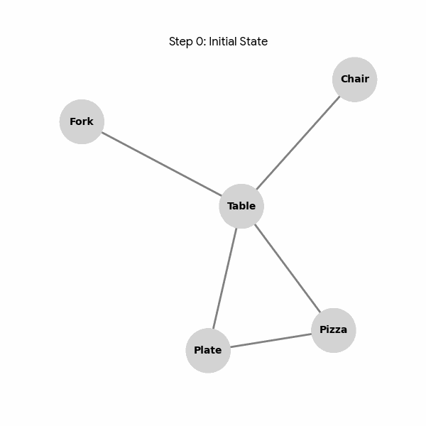

# Grounding Before Reasoning: Structural Hallucination Mitigation via Sequential Multi-modal Knowledge Graph Pruning

**Anonymous Authors**

---

## 📖 Abstract

Multi-modal Large Language Models (MLLM) frequently suffer from object hallucinations, where generated responses drift from visual reality due to the entanglement of perception and generation. In this paper, we reduce the mitigation of hallucinations to a process of structural denoising on **Multi-modal Knowledge Graphs** and propose the **Grounding Before Reasoning** framework. 

We introduce the **Knowledge-guided Structural Verification Agent (K-SVA)**, a neuro-symbolic architecture that treats the initial visual parse as a **noisy graph-structured hypothesis space**. By formulating grounding as a sequential decision-making process driven by a **Mixture of Pruning Experts (MoPE)**, our agent dynamically executes **knowledge graph pruning** to isolate a minimal sufficient evidence chain. This mechanism structurally filters the propagation of hallucinatory signals before generative reasoning begins.

Extensive experiments across **six benchmarks** (ScienceQA, GeoQA, VizWiz, TextVQA, POPE, etc.) demonstrate that our method significantly reduces hallucination rates while achieving state-of-the-art reasoning accuracy.

---

## 🚀 Key Features

### 1. Subtractive Paradigm Shift
Unlike traditional additive retrieval (e.g., GraphRAG) that accumulates noise, K-SVA adopts a **subtractive paradigm**, physically removing ungrounded nodes to prevent hallucination propagation.

*Figure 1: Comparison between Additive Retrieval (Left) and our Subtractive Grounding Paradigm (Right).*

### 2. K-SVA Architecture
The agent leverages a **Mixture of Pruning Experts (MoPE)** to evaluate node validity from three dimensions:
- **👁️ Visual Expert ($E_{vis}$)**: Detects object existence via fine-grained cross-modal alignment.
- **🧠 Logic Expert ($E_{log}$)**: Identifies semantic drift and logical violations (inspired by TransE).
- **🕸️ Topology Expert ($E_{topo}$)**: Assesses structural support and redundancy via GAT.

*Figure 2: The pipeline of the K-SVA framework, illustrating the MoPE module and the sequential pruning process.*

---

## 📊 Main Results

Comparison with state-of-the-art methods across reasoning and robustness benchmarks. Results are reported as **Mean ± Std**.

| Category | Method | ScienceQA | SQA-IMG | GeoQA | VizWiz | TextVQA | POPE (F1) |
| :--- | :--- | :---: | :---: | :---: | :---: | :---: | :---: |
| **LMMs** | InstructBLIP | 87.5 ± 0.8 | 85.2 ± 0.9 | 80.1 ± 1.1 | 52.4 ± 1.4 | 63.5 ± 0.8 | 77.5 ± 0.7 |
| | Shikra | 88.9 ± 0.6 | 86.5 ± 0.7 | 81.8 ± 0.8 | 54.8 ± 1.2 | 64.8 ± 0.7 | 80.1 ± 0.6 |
| | LLaVA-1.5 | 89.8 ± 0.5 | 87.5 ± 0.6 | 82.9 ± 0.7 | 57.2 ± 1.0 | 68.1 ± 0.6 | 83.5 ± 0.5 |
| **KG-Augmented** | Mucko | 88.2 ± 0.7 | 85.8 ± 0.8 | 80.5 ± 1.0 | 48.5 ± 1.5 | 57.2 ± 0.9 | 78.4 ± 0.8 |
| | KAT | 89.5 ± 0.6 | 86.9 ± 0.7 | 80.2 ± 0.9 | 51.6 ± 1.3 | 59.5 ± 0.8 | 79.8 ± 0.7 |
| **Graph Reasoning** | RED-GNN | 83.5 ± 1.2 | 80.1 ± 1.3 | 75.4 ± 1.5 | 43.8 ± 1.8 | 53.1 ± 1.1 | 74.2 ± 1.0 |
| | KGTrimmer | 90.2 ± 0.5 | 88.0 ± 0.6 | 83.1 ± 0.7 | 56.5 ± 1.1 | 61.5 ± 0.8 | 82.1 ± 0.6 |
| | MoKGR | 90.8 ± 0.5 | 88.5 ± 0.5 | 84.2 ± 0.6 | 59.1 ± 0.9 | 65.0 ± 0.7 | 84.4 ± 0.5 |
| **Structure-RAG** | HOLMES | 90.3 ± 0.6 | 87.9 ± 0.7 | 83.5 ± 0.8 | 58.9 ± 1.0 | 64.5 ± 0.8 | 82.9 ± 0.6 |
| | PathRAG | 90.6 ± 0.5 | 88.3 ± 0.6 | 84.1 ± 0.7 | 59.2 ± 1.1 | 64.8 ± 0.7 | 83.5 ± 0.6 |
| | PoG | 91.2 ± 0.5 | **90.8 ± 0.5** | 84.8 ± 0.7 | 59.8 ± 1.2 | 67.5 ± 0.7 | 85.1 ± 0.6 |
| **Ours** | **K-SVA** | **92.8 ± 0.4** | 89.0 ± 0.6 | **86.5 ± 0.5** | **63.5 ± 0.7** | **69.2 ± 0.5** | **88.2 ± 0.4** |

> **Note**: **Bold** denotes the best performance. K-SVA achieves consistent improvements in noise-intensive scenarios (VizWiz) and hallucination mitigation (POPE), validating the "Grounding Before Reasoning" paradigm.

*Figure 3: Sensitivity analysis and robustness comparison under varying noise levels.*

---

### 🎥 Dynamic Pruning Demo
Here we visualize the **K-SVA Agent** eliminating a hallucinated object ("Pizza") from the graph.

  

